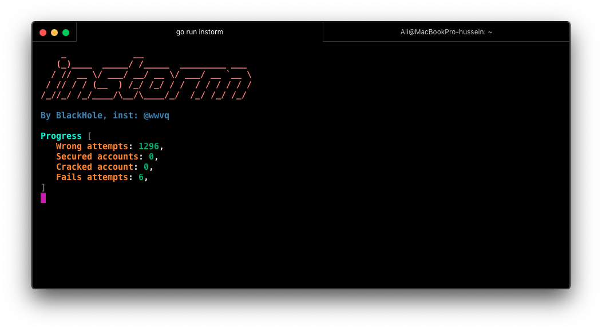
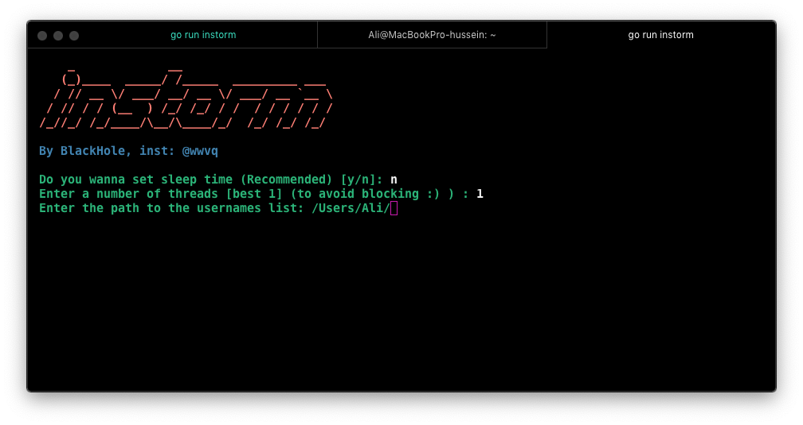

# instorm
instagram cracker written in go language.




# installation
```
git clone github.com/justghostz/instorm.git ~/go/src/instorm
```
# libraries
```
go get github.com/fatih/color
go get github.com/google/uuid
```
# run
```
go run instorm
```
# build
```
cd ~/go/src/instorm && go build -o build/instorm instorm
```
# about
instagram: @fenllz
